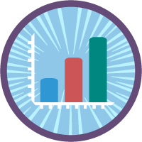
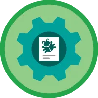

<h1 align="center">🌟 Salesforce Trailhead Journey — Pranjali Kulkarni 🌟</h1>

  
  
  

---

> **Goal:** To become a Salesforce Certified Admin and reach the **Mountaineer** rank by continuous learning and hands-on practice.

---

## 📊 Progress toward Ranger

🟦🟦🟦🟦⬜⬜⬜⬜⬜⬜⬜⬜⬜⬜⬜⬜⬜ (18 / 100)

---

## 🔥 Current Status
| Rank     | Total Badges | Superbadges | Current Focus                        |
|----------|---------------|--------------|--------------------------------------|
| **Adventurer** | **18** badges  | 0            | Lightning Web Components and Salesforce Dat |

---

## 🏅 My Badge Collection

| Date       | Badge Name                                                    | Badge |
|------------|----------------------------------------------------------------|-------|
| 2025-08-11 | **Your Guide to Trailhead**                                   |  |
| 2025-08-12 | **Build a Data Model for a Travel Approval App**              |  |
| 2025-08-12 | **Customize UI for a Travel Approval App**                    |  |
| 2025-08-12 | **Add Business Logic to a Travel Approval App**               |  |
| 2025-08-12 | **User Management**                                           |  |
| 2025-08-16 | **Add Reports and Dashboards to a Travel Approval App**       |  |
| 2025-08-16 | **Reports & Dashboards: Quick Look**                          |  |
| 2025-08-16 | **Reports & Dashboards: Quick Start**                         |  |
| 2025-08-16 | **Reports & Dashboards for Lightning Experience**             |  |
| 2025-08-19 | **Apex Testing: Review Testing Fundamental**                  |  |
| 2025-08-23 | **Quick Start: Visual Studio Code for Salesforce Development**                            |  |
| 2025-08-23 | **Apex Basics & Database**                            |  |
| 2025-08-23 | **Apex Testing: Write Unit Tests**                            |  |
| 2025-08-24 | **Lightning Web Components Basics**                           |  |
| 2025-08-24 | **Quick Start: Lightning Web Components**                     |  |
| 2025-08-24 | **Communicate Between Lightning Web Components**              |  |
| 2025-08-24 | **Lightning Web Components and Salesforce Data**              |  |
| 2025-08-27 | **Apex Testing: Prepare for Unit Testing**                    |  |

---

## 🎯 Goals for This Month
- ✅ Complete Beginner’s Quest
- 🔜 Reach **Mountaineer Rank**
- 🔜 Continue Admin modules on User Security & Automation
- ⭐ Start working on a **Superbadge**

---

## 🔗 Connect with Me
[View My Trailhead Profile](https://www.salesforce.com/trailblazer/profile)

